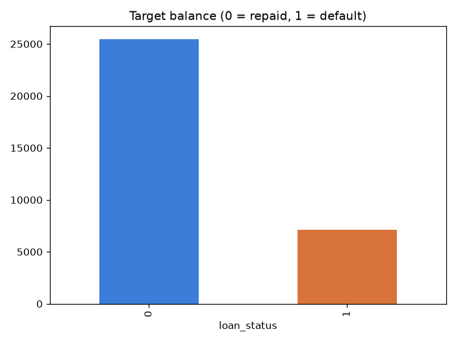
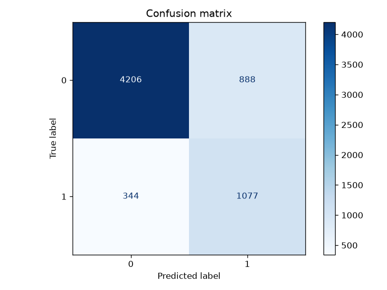
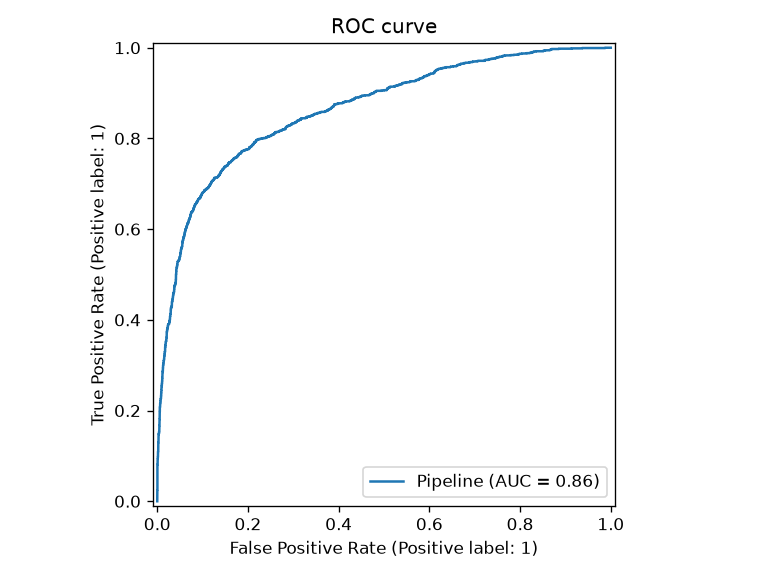
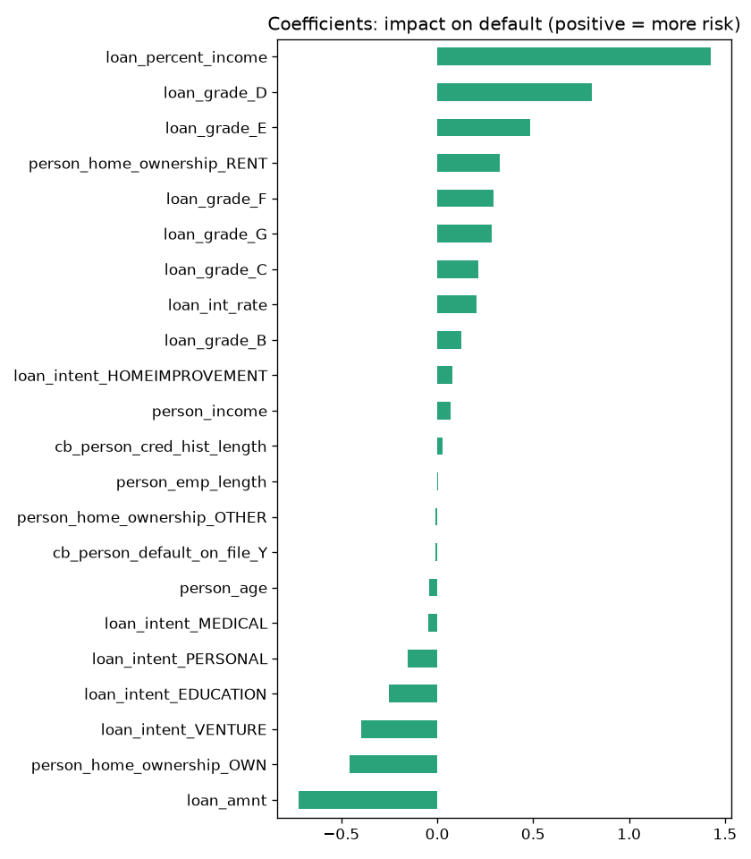

# Credit-default-prediction
Predicting loan default with machine learning
# Credit Default Prediction

Predicting whether a borrower will default on a loan, using machine learning on ~32,500 real loan records. The focus is not just accuracy, but catching the borrowers who actually default — the metric that matters for a lender.

## Problem
Banks lose money when they approve loans to people who don't repay. This project builds and evaluates a model that estimates the risk of default from a borrower's profile.

## Dataset
- **Source:** [Credit Risk Dataset (Kaggle)](https://www.kaggle.com/datasets/laotse/credit-risk-dataset), ~32,500 loans, 12 features. Downloaded reproducibly via `kagglehub`.
- **Target:** `loan_status` (1 = default, 0 = repaid). About **22% default** → an imbalanced problem.
- **Features:** age, income, home ownership, employment length, loan intent, loan grade, amount, interest rate, loan-to-income ratio, prior default, credit history length.

## Approach
1. **Explore** (`explore.py`) — inspect the data with `head`, `info`, `describe`.
2. **Prepare** (`prepare.py`) — impute missing values with the median, remove impossible outliers (age > 100, employment length > 60), one-hot encode categorical columns → `data/clean.csv`.
3. **Train** (`train.py`) — stratified train/test split; a `StandardScaler` + `LogisticRegression` pipeline with `class_weight="balanced"`; hyperparameter `C` tuned with 5-fold `GridSearchCV` (best `C = 0.1`); model saved with `joblib`.
4. **Evaluate & visualise** (`plots.py`) — load the saved model and generate the figures below.

## Results
| Metric | Value |
|---|---|
| ROC AUC | **0.86** |
| Recall (default) | **0.76** |
| Precision (default) | 0.55 |
| Accuracy | 0.81 |

By optimising for the **recall of defaults** instead of accuracy, the model catches **1,077 of 1,421** real defaults (76%) — versus only 43% for a naive baseline. The trade-off is more false alarms, which is worth it when missing a default costs more than rejecting a good borrower.






## What drives default
The model is interpretable and aligns with credit-risk intuition: a high **loan-to-income ratio**, lower **credit grades (D–G)**, **renting**, and higher **interest rates** increase default risk, while **home ownership** lowers it.

## How to run
```bash
pip install pandas scikit-learn matplotlib kagglehub joblib
python prepare.py   # clean + encode  -> data/clean.csv
python train.py     # train, evaluate -> model.joblib
python plots.py     # generate figures/
```

## Next steps
- Try tree-based models (Random Forest, Gradient Boosting) for higher recall/precision.
- Add SHAP for per-prediction explanations.
- Tune the decision threshold based on the business cost of each error.

## Tech
Python · pandas · scikit-learn · matplotlib · kagglehub · joblib